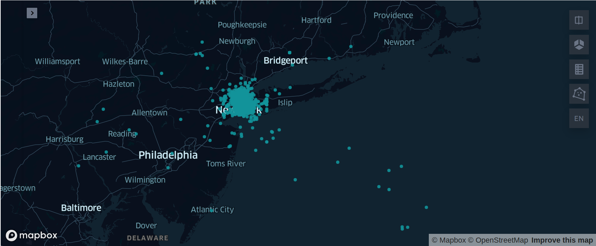
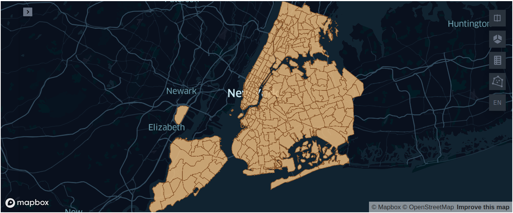
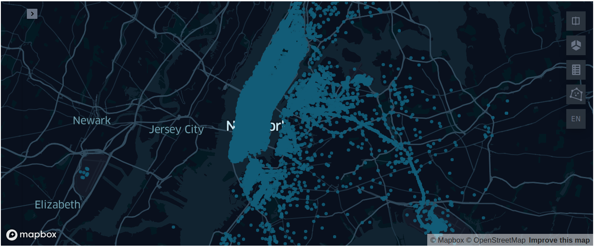
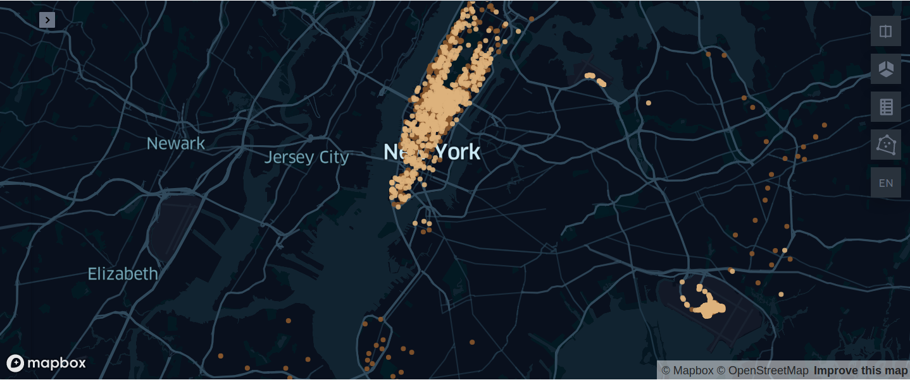

# Arctern 助力分析纽约出租车数据

## 环境准备

- #### [安装基于 Python 的 Arctern 后台](https://arctern.io/docs/versions/v0.2.x/development-doc-cn/html/quick_start/installation.html#id1)

- #### 安装 Jupyter

  在上一步中的 `arctern_env` 环境中执行以下命令安装 Jupyter：

  ```bash
  $ conda install -c conda-forge jupyterlab
  ```
  
- #### 安装依赖库

  在 `arctern_env` 环境中执行以下命令安装相关依赖库：

  ```bash
  $ pip install keplergl pyshp sridentify
  ```


## 下载数据

本文将介绍如何利用 Arctern 处理纽约出租车数据，并使用 keplergl 展示数据。需要下载 20 万条纽约出租车数据和纽约市的地形数据图，默认将其下载至 `/tmp` 下：

```bash
$ cd /tmp
# 下载纽约出租车数据
$ wget https://media.githubusercontent.com/media/zilliztech/arctern-resources/benchmarks/benchmarks/dataset/nyc_taxi/0_2M_nyc_taxi_and_building/0_2M_nyc_taxi_and_building.csv
# 下载并解压纽约市的地形数据图
$ wget https://s3.amazonaws.com/nyc-tlc/misc/taxi_zones.zip
$ unzip taxi_zones.zip
```


## 运行 jupyter-notebook

下载 [arctern_nytaxi_bootcamp.ipynb](./arctern_nytaxi_bootcamp.ipynb) 文件，在 `arctern_env` 环境中运行 jupyter notebook：

```bash
$ wget https://raw.githubusercontent.com/zilliztech/arctern-bootcamp/master/nytaxi/arctern_nytaxi_bootcamp.ipynb
# 运行 jupyter notebook
$ jupyter notebook
```

在 jupyter 网页中打开 arctern_nytaxi_bootcamp.ipynb 文件，就可以开始运行代码了。


## 纽约出租车数据分析示例

接下来将介绍如何利用 Arctern 处理大规模的 gis 数据，同时结合 Keplergl 展示数据，你也可以用 jupyter 直接运行 [arctern_nytaxi_bootcamp.ipynb](./arctern_nytaxi_bootcamp.ipynb) 代码。

### 1. 数据预处理

本文示例数据提取自纽约出租车中的 20 万条，当我们在处理大规模数据时通常会存在一些噪点数据，而这些噪点数据通常不易发现却又影响分析结果，那么如何快速发现噪点数据以及数据预处理就是我们分析数据的一个重点。

#### 1.1 数据加载

首先根据数据集中各个字段的名称和数据类型，构建数据的 `schema` 并导入数据集，当然，你可以通过修改 `schema` 来导入你已有的数据。

```python
import pandas as pd
nyc_schame={
    "VendorID":"string",
    "tpep_pickup_datetime":"string",
    "tpep_dropoff_datetime":"string",
    "passenger_count":"int64",
    "trip_distance":"double",
    "pickup_longitude":"double",
    "pickup_latitude":"double",
    "dropoff_longitude":"double",
    "dropoff_latitude":"double",
    "fare_amount":"double",
    "tip_amount":"double",
    "total_amount":"double",
    "buildingid_pickup":"int64",
    "buildingid_dropoff":"int64",
    "buildingtext_pickup":"string",
    "buildingtext_dropoff":"string",
}
nyc_df=pd.read_csv("/tmp/0_2M_nyc_taxi_and_building.csv",
               dtype=nyc_schame,
               date_parser=pd.to_datetime,
               parse_dates=["tpep_pickup_datetime","tpep_dropoff_datetime"])
```

#### 1.2 数据展示

根据上面加载的数据 `schema` 可以看出我们本次处理的 gis 数据主要包括出租车辆的上车点和下车点的经纬度， 接下来将 Arctern 结合 keplergl 展示在地图上所有 gis 点位置，根据可视化结果可以看出数据集的一些情况。首先加载车辆的上车点数据：

```python
import arctern
from keplergl import KeplerGl

pickup_points = arctern.ST_Point(nyc_df.pickup_longitude,nyc_df.pickup_latitude)
KeplerGl(data={"pickup_points": pd.DataFrame(data={'pickup_points':arctern.ST_AsText(pickup_points)})})
```



返回的结果在地图上支持交互操作，可以发现输入的出租车数据存有噪点，有些上车点已经到海面上了，实际上所有数据应该都集中在陆地上才是合理的，这些噪点数据就需要我们通过一定的方法进行清洗过滤。

#### 1.3 数据过滤

为了正确分析纽约市区中的出租车数据，接下来我们会根据纽约市的地形图来过滤数据，即不在纽约市地图中的数据视为噪点数据并进行过滤，这一步骤也会介绍如何将加载的 GeoJSON 数据转换为 “EPSG:4326” ，即纬度和经度坐标。

##### 1.3.1 数据转换

读取纽约市的地形数据图，该地形数据是以 GeoJSON 格式存储的，首先使用 Arctern 解析 GeoJSON 数据：

```python
import shapefile
import json
nyc_shape = shapefile.Reader("/tmp/taxi_zones.shp")
nyc_zone=[ shp.shape.__geo_interface__  for shp in nyc_shape.shapeRecords()]
nyc_zone=[json.dumps(shp) for shp in nyc_zone]
nyc_zone_series=pd.Series(nyc_zone)
nyc_zone_arctern=arctern.ST_GeomFromGeoJSON(nyc_zone_series)
arctern.ST_AsText(nyc_zone_arctern)
```

Arctern 读取的数据结果如下：

```
0      POLYGON ((933100.91835271 192536.085697202,933...
1      MULTIPOLYGON (((1033269.24359129 172126.007812...
2      POLYGON ((1026308.76950666 256767.697540373,10...
3      POLYGON ((992073.46679686 203714.07598877,9920...
4      POLYGON ((935843.310493261 144283.335850656,93...
                             ...                        
258    POLYGON ((1025414.78196019 270986.139363825,10...
259    POLYGON ((1011466.96605045 216463.005203798,10...
260    POLYGON ((980555.204311222 196138.486258477,98...
261    MULTIPOLYGON (((999804.794550449 224498.527048...
262    POLYGON ((997493.322715312 220912.386162326,99...
Length: 263, dtype: object
```

获得当前纽约市地形数据文件的坐标系，并利用 Arctern 将该坐标系转成经纬度坐标系，即 “EPSG:4326” ：

```python
from sridentify import Sridentify
ident = Sridentify()
ident.from_file('/tmp/taxi_zones.prj')
src_crs = ident.get_epsg()
nyc_arctern_4326 = arctern.ST_Transform(nyc_zone_arctern,f'EPSG:{src_crs}','EPSG:4326')
arctern.ST_AsText(nyc_arctern_4326)
```

坐标转换后的结果如下：

```
0      POLYGON ((-74.184453 40.694996,-74.184489 40.6...
1      MULTIPOLYGON (((-73.8233759726066 40.638987047...
2      POLYGON ((-73.8479261409998 40.871342234,-73.8...
3      POLYGON ((-73.9717741096532 40.7258212813371,-...
4      POLYGON ((-74.1742173809999 40.5625680859999,-...
                             ...                        
258    POLYGON ((-73.851071161919 40.910371520111,-73...
259    POLYGON ((-73.9017537339999 40.760775475,-73.9...
260    POLYGON ((-74.0133261089999 40.7050307879999,-...
261    MULTIPOLYGON (((-73.9438325669999 40.782859089...
262    POLYGON ((-73.95218622 40.7730198449999,-73.95...
Length: 263, dtype: object
```

根据转换后的经纬度坐标，绘制的纽约市地形图如下：

```python
KeplerGl(data={"nyc_zones": pd.DataFrame(data={'nyc_zones':arctern.ST_AsText(nyc_arctern_4326)})})
```


##### 1.3.2 数据清洗

为了分析纽约市区中的出租车数据，根据纽约市的地形图，我们认为不在图内的点即为噪点，以此过滤出租车数据中的噪点，首先我们根据纽约市区的轮廓图对上车点进行过滤：


```python
# 该步骤会比较耗时
nyc_arctern_one = arctern.ST_Union_Aggr(nyc_arctern_4326)
nyc_arctern_one = arctern.ST_SimplifyPreserveTopology(nyc_arctern_one,0.005)
is_in_nyc = [arctern.ST_Within(point,nyc_arctern_one[0])[0] for point in pickup_points ]
pickup_in_nyc = pickup_points[pd.Series(is_in_nyc)]
```

绘制出数据过滤后的上车点：

```python
KeplerGl(data={"pickup_points": pd.DataFrame(data={'pickup_points':arctern.ST_AsText(pickup_in_nyc)})})
```


我们知道纽约出租车数据中有上车点和下车点的经纬度数据，那么根据同样的方法，对乘客的下车点进行过滤：

```python
# 该步骤会比较耗时
dropoff_points = arctern.ST_Point(nyc_df.dropoff_longitude,nyc_df.dropoff_latitude)
is_dorpoff_in_nyc = [arctern.ST_Within(point,nyc_arctern_one[0])[0] for point in dropoff_points ]
dropoff_in_nyc=dropoff_points[is_dorpoff_in_nyc]
KeplerGl(data={"drop_points": pd.DataFrame(data={'drop_points':arctern.ST_AsText(dropoff_in_nyc)})})
```


根据上车点和下车点经纬度数据，在最初的数据上过滤所有的非法数据：


```python
is_resonable = [is_dorpoff_in_nyc[idx] & is_in_nyc[idx] for idx in range(0,len(is_in_nyc)) ]
in_nyc_df=nyc_df[pd.Series(is_resonable)]
in_nyc_df.fare_amount.describe()
```

过滤后的数据关于行程费用的描述信息为：


    count    192805.000000
    mean          9.786233
    std           7.270556
    min           2.500000
    25%           5.700000
    50%           7.700000
    75%          11.300000
    max         175.000000
    Name: fare_amount, dtype: float64
综上我们完成了数据过滤，根据预处理的数据我们将对出租车数据进行分析。

### 2. 数据分析

前面我们将数据进行了清洗过滤，这一步十分重要，它可以保证我后期的数据分析结果有效。接下来我们将根据交易额和里程距离分析出租车的运营情况。

#### 2.1 关于交易额

我们按照交易额提取费用大于 50 美元的数据，并绘制出租车的上车点和下车点：


```python
fare_amount_gt_50 = in_nyc_df[in_nyc_df.fare_amount > 50]
pickup_50 = arctern.ST_Point(fare_amount_gt_50.pickup_longitude,fare_amount_gt_50.pickup_latitude)
dropoff_50 = arctern.ST_Point(fare_amount_gt_50.dropoff_longitude,fare_amount_gt_50.dropoff_latitude)
KeplerGl(data={"pickup": pd.DataFrame(data={'pickup':arctern.ST_AsText(pickup_50)}),
               "dropoff":pd.DataFrame(data={'dropoff':arctern.ST_AsText(dropoff_50)})
              })
```


可以展开结果地图中左上角的小三角，对当前的图层进行操作，例如隐藏上车点或下车点，我们发现费用大于 50 美元的，基本都是从市中心触发去周边比较远的地方。

#### 2.2 关于距离

我们按照里程距离来计算上车点和下车点的直线距离：


```python
nyc_distance=arctern.ST_DistanceSphere(arctern.ST_Point(in_nyc_df.pickup_longitude,
                                                        in_nyc_df.pickup_latitude),
                                       arctern.ST_Point(in_nyc_df.dropoff_longitude,
                                                        in_nyc_df.dropoff_latitude))
nyc_distance.index=in_nyc_df.index
nyc_distance.describe()
```
车辆的直线距离结果描述为：


```
    count    192805.000000
    mean       3150.931171
    std        3326.144461
    min           0.000000
    25%        1224.998626
    50%        2088.286128
    75%        3753.104118
    max       35395.487197
    dtype: float64
```

获得直线距离大于 20 公里的点，并绘制所有直线距离大于 20 公里的上车点和下车点：

```python
nyc_with_distance=pd.DataFrame({"pickup_longitude":in_nyc_df.pickup_longitude,
                                "pickup_latitude":in_nyc_df.pickup_latitude,
                                "dropoff_longitude":in_nyc_df.dropoff_longitude,
                                "dropoff_latitude":in_nyc_df.dropoff_latitude,
                                "sphere_distance":nyc_distance
                               })

nyc_dist_gt = nyc_with_distance[nyc_with_distance.sphere_distance > 20e3]
pickup_gt = arctern.ST_Point(nyc_dist_gt.pickup_longitude,nyc_dist_gt.pickup_latitude)
dropoff_gt = arctern.ST_Point(nyc_dist_gt.dropoff_longitude,nyc_dist_gt.dropoff_latitude)

KeplerGl(data={"pickup": pd.DataFrame(data={'pickup':arctern.ST_AsText(pickup_gt)}),
               "dropoff":pd.DataFrame(data={'dropoff':arctern.ST_AsText(dropoff_gt)})
              })
```



同样我们发现直线距离大于 20 公里的，也都是从市中心触发去周边比较远的地方。综上我们完成了对出租车数据关于交易额和里程距离的分析，更多分析功能可以参考 **[Arctern API](https://arctern.io/docs/versions/v0.2.x/development-doc-cn/html/api/pandas_api/pandas_api.html)**。
