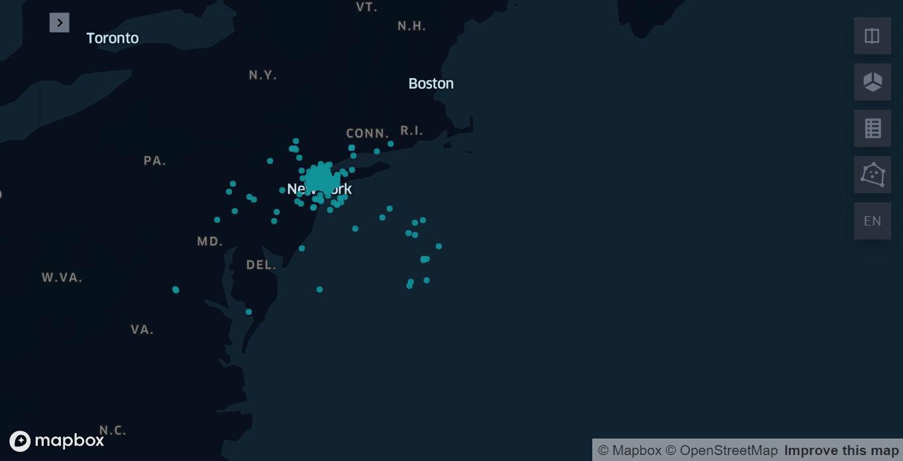
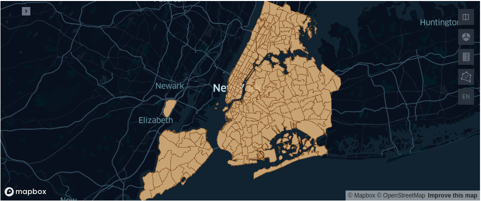
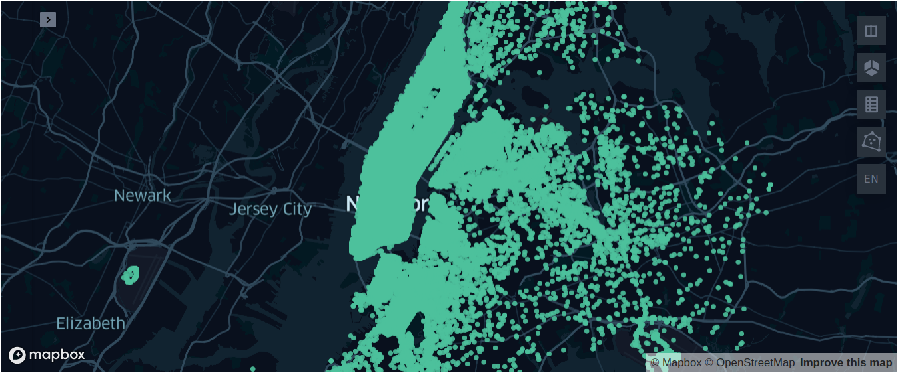
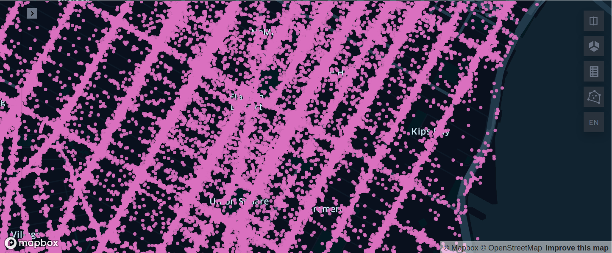
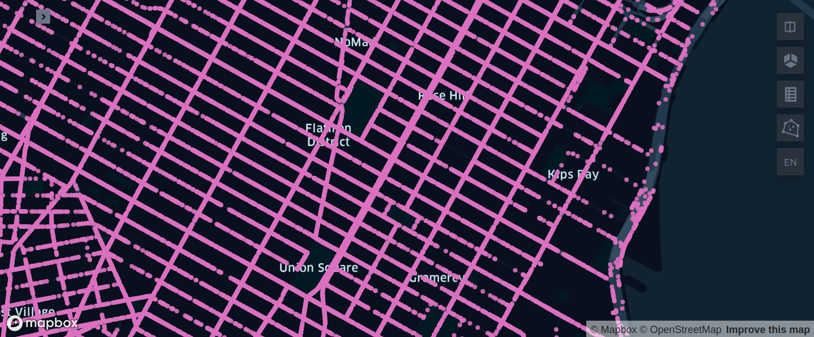

# Analyzing New York City Taxi Dataset with Arctern

This tutorial will guide you through analyzing New York City Taxi dataset with Arctern for massive  Geospatial data processing and with keplergl for data visualization. 

## Prerequisite

- #### [Install Arctern](https://arctern.io/docs/versions/v0.2.x/development-doc-cn/html/quick_start/standalone_installation.html)

- #### Install Jupyter Notebook

  Run the following command in the `artern_env` environment of the previous step to install Jupyter Notebook:

  ```bash
  $ conda install -c conda-forge notebook
  ```
  
- #### Install required libraries

  Run the following command in the `arctern_env` environment to install required libraries:

  ```bash
  $ pip install keplergl pyshp sridentify
  ```


## Data Preparation

Download the data prepared for this tutorial including: 200,000 New York City taxi data records and New York City topographic map. Save the data in `/tmp` by default:

```bash
$ cd /tmp
# Download New York City Taxi data
$ wget https://raw.githubusercontent.com/zilliztech/arctern-bootcamp/master/nytaxi/file/0_2M_nyc_taxi_and_building.csv
# Download and unzip the topographic map of New York
$ wget https://github.com/zilliztech/arctern-bootcamp/raw/master/nytaxi/file/taxi_zones.zip
$ unzip -d taxi_zones taxi_zones.zip
# Download New York City road network data
$ wget https://raw.githubusercontent.com/zilliztech/arctern-bootcamp/master/nytaxi/file/nyc_road.csv
# Download kepler config file
$ wget https://raw.githubusercontent.com/zilliztech/arctern-bootcamp/master/nytaxi/file/map_config.json
```


## Initialize Jupyter Notebook

Download [arctern_nytaxi_bootcamp.ipynb](./arctern_nytaxi_bootcamp.ipynb) ，start jupyter notebook with `arctern_env` environment：

```bash
$ wget https://raw.githubusercontent.com/zilliztech/arctern-bootcamp/master/nytaxi_en/arctern_nytaxi_bootcamp.ipynb
# starting jupyter notebook
$ jupyter notebook
```

Open arctern_nytaxi_bootcamp.ipynb in jupyter notebook, start to have fun with the example codes.


## Introduce of the example codes

This example includes codes for data cleansing and data analyzing.

### 1. Data cleansing

The data used in this tutorial is 200,000 records extracted from New York City taxi dataset, however, noisy data is inevitable when dealing data with such scale. Noisy data can usually affect the results directly, so identifying and cleansing the noisy data efficiently is quite critical in data analyzing procedure.

#### 1.1 Data loading

As first step, define a schema "nyc_schema" to describe all column names and data types according to the 200,000 records, then load these records into the dataframe.

```python
import pandas as pd
nyc_schema={
    "VendorID":"string",
    "tpep_pickup_datetime":"string",
    "tpep_dropoff_datetime":"string",
    "passenger_count":"int64",
    "trip_distance":"double",
    "pickup_longitude":"double",
    "pickup_latitude":"double",
    "dropoff_longitude":"double",
    "dropoff_latitude":"double",
    "fare_amount":"double",
    "tip_amount":"double",
    "total_amount":"double",
    "buildingid_pickup":"int64",
    "buildingid_dropoff":"int64",
    "buildingtext_pickup":"string",
    "buildingtext_dropoff":"string",
}
nyc_df=pd.read_csv("/tmp/0_2M_nyc_taxi_and_building.csv",
               dtype=nyc_schema,
               date_parser=pd.to_datetime,
               parse_dates=["tpep_pickup_datetime","tpep_dropoff_datetime"])
```

#### 1.2 Data display

The data set includes longitude and latitude of pick-up and drop-off locations for each taxi trip. We can visualize all these locations on the map with Arctern and keplergl to get better understanding of the data. 

Load the pick-up locations:

```python
import arctern
from keplergl import KeplerGl

pickup_points = arctern.ST_Point(nyc_df.pickup_longitude,nyc_df.pickup_latitude)
KeplerGl(data={"pickup_points": pd.DataFrame(data={'pickup_points':arctern.ST_AsText(pickup_points)})})
```



With the visualized results on the map, we can identify the noisy data easily, as some of the pick-up locations are in the ocean. These noisy data need to be filtered.

#### 1.3 Data filter

In order to get rid of the noisy data, we can filter the data according to the topographic map of New York City. The idea is that, if the pick-up or drop-off location is not within the New York City boundary, this record should be filtered. To do this, we also need to converted the New York City topographic map stored in the GeoJSON data format to "EPSG: 4326" geodetic coordinate system.

##### 1.3.1 Data conversion

Load the New York City topographic map from the GeoJSON file with Arctern:

```python
import shapefile
import json
nyc_shape = shapefile.Reader("/tmp/taxi_zones/taxi_zones.shp")
nyc_zone=[ shp.shape.__geo_interface__  for shp in nyc_shape.shapeRecords()]
nyc_zone=[json.dumps(shp) for shp in nyc_zone]
nyc_zone_series=pd.Series(nyc_zone)
nyc_zone_arctern=arctern.ST_GeomFromGeoJSON(nyc_zone_series)
arctern.ST_AsText(nyc_zone_arctern)
```

Display the loaded map data:

```
0      POLYGON ((933100.91835271 192536.085697202,933...
1      MULTIPOLYGON (((1033269.24359129 172126.007812...
2      POLYGON ((1026308.76950666 256767.697540373,10...
3      POLYGON ((992073.46679686 203714.07598877,9920...
4      POLYGON ((935843.310493261 144283.335850656,93...
                             ...                        
258    POLYGON ((1025414.78196019 270986.139363825,10...
259    POLYGON ((1011466.96605045 216463.005203798,10...
260    POLYGON ((980555.204311222 196138.486258477,98...
261    MULTIPOLYGON (((999804.794550449 224498.527048...
262    POLYGON ((997493.322715312 220912.386162326,99...
Length: 263, dtype: object
```

Get the current coordinate system of the New York City topographic map, and use Arctern to convert the coordinate system to "EPSG: 4326":

```python
from sridentify import Sridentify
ident = Sridentify()
ident.from_file('/tmp/taxi_zones/taxi_zones.prj')
src_crs = ident.get_epsg()
nyc_arctern_4326 = arctern.ST_Transform(nyc_zone_arctern,f'EPSG:{src_crs}','EPSG:4326')
arctern.ST_AsText(nyc_arctern_4326)
```

This is the results after coordinate system conversion:

```
0      POLYGON ((-74.184453 40.694996,-74.184489 40.6...
1      MULTIPOLYGON (((-73.8233759726066 40.638987047...
2      POLYGON ((-73.8479261409998 40.871342234,-73.8...
3      POLYGON ((-73.9717741096532 40.7258212813371,-...
4      POLYGON ((-74.1742173809999 40.5625680859999,-...
                             ...                        
258    POLYGON ((-73.851071161919 40.910371520111,-73...
259    POLYGON ((-73.9017537339999 40.760775475,-73.9...
260    POLYGON ((-74.0133261089999 40.7050307879999,-...
261    MULTIPOLYGON (((-73.9438325669999 40.782859089...
262    POLYGON ((-73.95218622 40.7730198449999,-73.95...
Length: 263, dtype: object
```
With the converted latitude and longitude coordinates, the topographic map of New York City is rendered as follows:

```python
KeplerGl(data={"nyc_zones": pd.DataFrame(data={'nyc_zones':arctern.ST_AsText(nyc_arctern_4326)})})
```


##### 1.3.2 Data cleaning

In order to clean up the noisy data, we can filter out records with pick-up locations outside the skeleton map of New York City.


```python
# this step will cost some time
index_nyc = arctern.sjoin(pickup_points, nyc_arctern_4326, 'within')
is_in_nyc = index_nyc.map(lambda x: x >= 0)
pickup_in_nyc = pickup_points[pd.Series(is_in_nyc)]
```

Display the pick-up locations after filtering.

```python
KeplerGl(data={"pickup_points": pd.DataFrame(data={'pickup_points':arctern.ST_AsText(pickup_in_nyc)})})
```


Filter these data by the drop-off locations.

```python
# this step will cost some time
dropoff_points = arctern.ST_Point(nyc_df.dropoff_longitude,nyc_df.dropoff_latitude)
index_nyc = arctern.sjoin(dropoff_points, nyc_arctern_4326, 'within')
is_dorpoff_in_nyc = index_nyc.map(lambda x: x >= 0)
dropoff_in_nyc=dropoff_points[is_dorpoff_in_nyc]
KeplerGl(data={"drop_points": pd.DataFrame(data={'drop_points':arctern.ST_AsText(dropoff_in_nyc)})})
```



To clean all noisy data, we can filter data with both pick-up locations and the drop-off locations:


```python
is_resonable = [is_dorpoff_in_nyc[idx] & is_in_nyc[idx] for idx in range(0,len(is_in_nyc)) ]
in_nyc_df=nyc_df[pd.Series(is_resonable)]
in_nyc_df.fare_amount.describe()
```

The summarized travel cost information for the filtered data:


    count    195479.000000
    mean          9.791914
    std           7.266372
    min           2.500000
    25%           5.700000
    50%           7.700000
    75%          11.300000
    max         175.000000
    Name: fare_amount, dtype: float64

After filtering the data according to the skeleton map of New York City, we found that some locations were far from the road, and even plotted on certain buildings:

```python
import json
with open("/tmp/map_config.json", "r") as f:
    config = json.load(f)
KeplerGl(data={"projectioned_point": pd.DataFrame(data={'projectioned_point':arctern.ST_AsText(pickup_in_nyc)})},config=config)
```


We think that the data farther away from the road is noisy data, which is more than 100 meters from the road. So we have to filter the noisy data by the New York City road network.

First load the New York City road network:

```python
import arctern
nyc_road=pd.read_csv("/tmp/nyc_road.csv", dtype={"roads":"string"}, delimiter='|')
roads=arctern.ST_GeomFromText(nyc_road.roads)
```

 Filter data with both pick-up locations and the drop-off locations:

```python
pickup_points = arctern.ST_Point(in_nyc_df.pickup_longitude,in_nyc_df.pickup_latitude)
dropoff_points = arctern.ST_Point(in_nyc_df.dropoff_longitude,in_nyc_df.dropoff_latitude)
is_pickup_near_road = arctern.near_road(roads, pickup_points)
is_dropoff_near_road = arctern.near_road(roads, dropoff_points)
is_resonable = [is_pickup_near_road[idx] & is_dropoff_near_road[idx] for idx in range(0,len(is_dropoff_near_road)) ]
in_nyc_df=in_nyc_df.reset_index()
on_road_nyc_df=in_nyc_df[pd.Series(is_resonable)]
```

After filtering out the data far away from the road, we bind the pick-up location to the nearest road to generate a new pick-up location within the road :

```python
pickup_points = arctern.ST_Point(on_road_nyc_df.pickup_longitude,on_road_nyc_df.pickup_latitude)
projectioned_pickup = arctern.nearest_location_on_road(roads, pickup_points)
```

Plot the pick-up location within the road:

```python
KeplerGl(data={"projectioned_point": pd.DataFrame(data={'projectioned_point':arctern.ST_AsText(projectioned_pickup)})},config=config)
```


Bind the drop-off location to the nearest road to generate a new drop-off location within the road :

```python
dropoff_points = arctern.ST_Point(on_road_nyc_df.dropoff_longitude,on_road_nyc_df.dropoff_latitude)
projectioned_dropoff = arctern.nearest_location_on_road(roads, dropoff_points)
KeplerGl(data={"projectioned_point": pd.DataFrame(data={'projectioned_point':arctern.ST_AsText(projectioned_dropoff)})},config=config)
```


After bind the pick-up location and drop-off loaction to the road, add the information to dataframe near_road_df:

```python
on_road_nyc_df.insert(16,'pickup_on_road',projectioned_pickup)
on_road_nyc_df.insert(17,'dropoff_on_road',projectioned_dropoff)
on_road_nyc_df.fare_amount.describe()
```

The summarized travel cost information for the filtered data:

    count    194812.000000
    mean          9.692408
    std           6.976446
    min           2.500000
    25%           5.700000
    50%           7.700000
    75%          11.000000
    max         175.000000
    Name: fare_amount, dtype: float64
Until now, data is cleaned, we can continue to do the analysis. 

### 2. Data analysis

Cleaned up data ensures valid analysis results. Next, we will analyze the New York City taxi dataset for transaction amount and straight-line distance.

#### 2.1 About amount

Plot pick-up and drop-off locations with transaction amount greater than $50:


```python
fare_amount_gt_50 = in_nyc_df[in_nyc_df.fare_amount > 50]
pickup_50 = arctern.ST_Point(fare_amount_gt_50.pickup_longitude,fare_amount_gt_50.pickup_latitude)
dropoff_50 = arctern.ST_Point(fare_amount_gt_50.dropoff_longitude,fare_amount_gt_50.dropoff_latitude)
KeplerGl(data={"pickup": pd.DataFrame(data={'pickup':arctern.ST_AsText(pickup_50)}),
               "dropoff":pd.DataFrame(data={'dropoff':arctern.ST_AsText(dropoff_50)})
              })
```


You can interactive with the map by expand the small triangle in the upper left corner, such as hiding the pick-up or drop-off locations. We can see that most trips with transaction amount greater than $50 are from the city center to far away places.

#### 2.2 About distance

Calculate the straight-line distance between the pick-up and the drop-off locations:


```python
nyc_distance=arctern.ST_DistanceSphere(arctern.ST_Point(in_nyc_df.pickup_longitude,
                                                        in_nyc_df.pickup_latitude),
                                       arctern.ST_Point(in_nyc_df.dropoff_longitude,
                                                        in_nyc_df.dropoff_latitude))
nyc_distance.index=in_nyc_df.index
nyc_distance.describe()
```
The straight-line distance summary for all the trips:


```
count    194155.000000
mean       3114.627009
std        3233.474564
min           0.000000
25%        1224.656797
50%        2088.272336
75%        3733.545547
max       35418.698339
dtype: float64
```

Get the pick-up and the drop-off locations for trips with a straight-line distance greater than 20 kilometers, and plot them.

```python
nyc_with_distance=pd.DataFrame({"pickup_longitude":in_nyc_df.pickup_longitude,
                                "pickup_latitude":in_nyc_df.pickup_latitude,
                                "dropoff_longitude":in_nyc_df.dropoff_longitude,
                                "dropoff_latitude":in_nyc_df.dropoff_latitude,
                                "sphere_distance":nyc_distance
                               })

nyc_dist_gt = nyc_with_distance[nyc_with_distance.sphere_distance > 20e3]
pickup_gt = arctern.ST_Point(nyc_dist_gt.pickup_longitude,nyc_dist_gt.pickup_latitude)
dropoff_gt = arctern.ST_Point(nyc_dist_gt.dropoff_longitude,nyc_dist_gt.dropoff_latitude)

KeplerGl(data={"pickup": pd.DataFrame(data={'pickup':arctern.ST_AsText(pickup_gt)}),
               "dropoff":pd.DataFrame(data={'dropoff':arctern.ST_AsText(dropoff_gt)})
              })
```


We can see that trips with straight-line distances greater than 20 kilometers are also from the city center to far away places. 

Now you have completed the analysis of New York City Taxi dataset on transaction amount and straight-line distance, for more functions please refer to **[Arctern API](https://arctern.io/docs/versions/v0.2.x/development-doc-cn/html/api/pandas_api/pandas_api.html)**。
