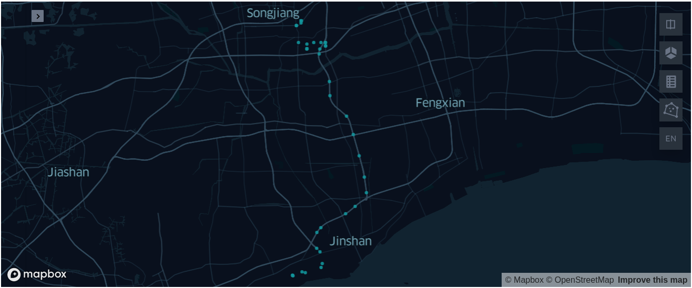
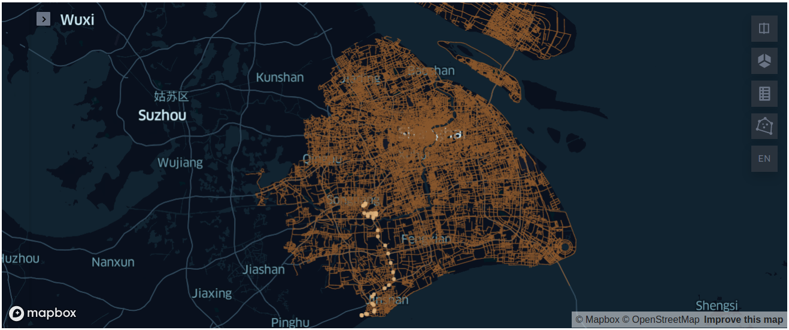
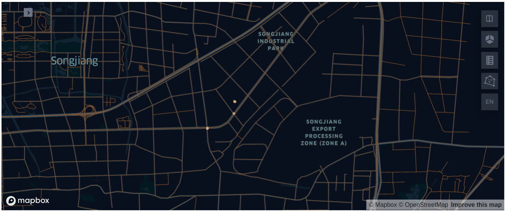
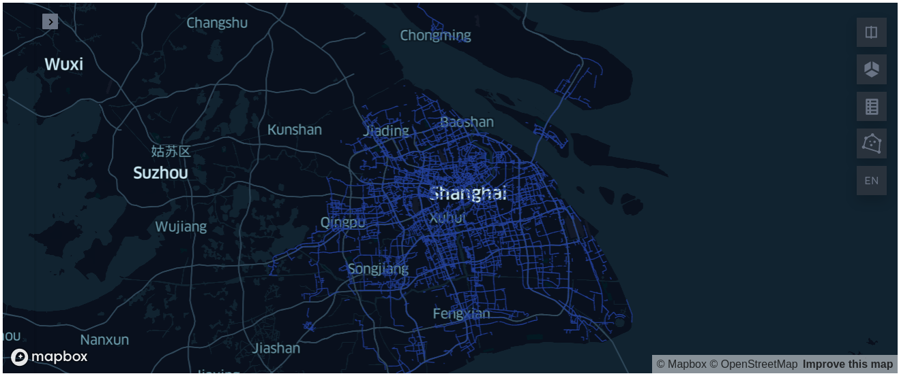
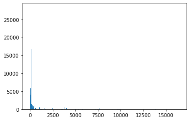
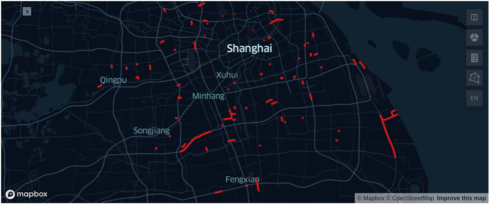

# Analyzing Shanghai Truck Dataset with Arctern

This tutorial will guide you through analyzing Shanghai Truck dataset with Arctern for massive Geospatial data processing and with keplergl for data visualization.

## Prerequisite

- #### [Install Arctern](https://arctern.io/docs/versions/v0.2.x/development-doc-en/html/quick_start/standalone_installation.html)

- #### Install Jupyter Notebook

  Run the following command in the `artern_env` environment of the previous step to install Jupyter Notebook:

  ```bash
  $ conda install -c conda-forge notebook
  ```

- #### Install required libraries

  Run the following command in the `arctern_env` environment to install required libraries:

  ```bash
  $ pip install keplergl matplotlib
  ```


## Data Preparation

Download the data prepared for this tutorial including: more than 2 million Shanghai Truck data records and Shanghai topographic map. Save the data in  `/tmp` by  default:

```bash
$ cd /tmp
# 下载并解压上海渣土车数据
$ wget https://github.com/arctern-io/arctern-bootcamp/raw/master/shtruck/file/20181016.zip
# 下载上海市的地形数据图
$ wget https://github.com/arctern-io/arctern-bootcamp/raw/master/shtruck/file/sh_roads.csv
```


## Initialize Jupyter Notebook

Download  [arctern_shtruck_bootcamp.ipynb](https://github.com/arctern-io/arctern-bootcamp/blob/master/nytaxi/arctern_shtruck_bootcamp_en.ipynb) , start jupyter notebook with `arctern_env` environment：

```bash
$ wget https://raw.githubusercontent.com/zilliztech/arctern-bootcamp/master/shtruck_en/arctern_shtruck_bootcamp.ipynb
# 运行 jupyter notebook
$ jupyter notebook
```

Open arctern_nytaxi_bootcamp.ipynb in jupyter notebook, start to have fun with the example codes.


## Introduce of the example codes

### 1. Data loading

Load Shanghai truck trajectory data, the original data has a total of 8 columns, here only read the 4 columns required for analysis: plate number, time, latitude and longitude.


```python
import pandas as pd
import arctern
from arctern import GeoSeries

sh_columns=[
    ("plate_number","string"),
    ("pos_time","string"),
    ("pos_longitude","double"),
    ("pos_latitude","double"),
    ("pos_direction0","double"),
    ("pos_direction1","double"),
    ("pos_direction2","double"),
    ("pos_direction3","double")
]

sh_select_columns={
                   "plate_number",
                   "pos_time",
                   "pos_longitude",
                   "pos_latitude"
                  }

sh_schema={}
sh_use_cols=[]
sh_names=[]
for idx in range(len(sh_columns)):
    if sh_columns[idx][0] in sh_select_columns:
        sh_schema[sh_columns[idx][0]] = sh_columns[idx][1]
        sh_use_cols.append(idx)
        sh_names.append(sh_columns[idx][0])
            
sh_df = pd.read_csv("/tmp/20181016.txt",
                    usecols=sh_use_cols,
                    names=sh_names,
                    dtype=sh_schema,
                    header=None,
                    delimiter="\t",
                    date_parser=pd.to_datetime,
                    parse_dates=["pos_time"])
```

According to the latitude and longitude, construct position information:


```python
sh_df["pos_point"]=GeoSeries.point(sh_df.pos_longitude,sh_df.pos_latitude)
sh_df
```


<div>
<table border="1" class="dataframe">
  <thead>
    <tr style="text-align: right;">
      <th></th>
      <th>plate_number</th>
      <th>pos_time</th>
      <th>pos_longitude</th>
      <th>pos_latitude</th>
      <th>pos_point</th>
    </tr>
  </thead>
  <tbody>
    <tr>
      <th>0</th>
      <td>沪DK7362</td>
      <td>2018-10-16 00:00:00</td>
      <td>121.273108</td>
      <td>30.989863</td>
      <td>POINT (121.273108 30.989863)</td>
    </tr>
    <tr>
      <th>1</th>
      <td>沪DT0830</td>
      <td>2018-10-16 00:00:00</td>
      <td>121.471555</td>
      <td>31.121763</td>
      <td>POINT (121.471555 31.121763)</td>
    </tr>
    <tr>
      <th>2</th>
      <td>沪EP2723</td>
      <td>2018-10-16 00:00:00</td>
      <td>121.717205</td>
      <td>31.380190</td>
      <td>POINT (121.717205 31.38019)</td>
    </tr>
    <tr>
      <th>3</th>
      <td>沪DH9100</td>
      <td>2018-10-16 00:00:00</td>
      <td>121.476368</td>
      <td>31.197768</td>
      <td>POINT (121.476368 31.197768)</td>
    </tr>
    <tr>
      <th>4</th>
      <td>沪DP8608</td>
      <td>2018-10-16 00:00:00</td>
      <td>121.826568</td>
      <td>31.096545</td>
      <td>POINT (121.826568 31.096545)</td>
    </tr>
    <tr>
      <th>...</th>
      <td>...</td>
      <td>...</td>
      <td>...</td>
      <td>...</td>
      <td>...</td>
    </tr>
    <tr>
      <th>2076589</th>
      <td>沪EG9666</td>
      <td>2018-10-16 23:59:31</td>
      <td>121.753138</td>
      <td>31.356040</td>
      <td>POINT (121.753138 31.35604)</td>
    </tr>
    <tr>
      <th>2076590</th>
      <td>沪DP8746</td>
      <td>2018-10-16 23:59:35</td>
      <td>121.447145</td>
      <td>31.125255</td>
      <td>POINT (121.447145 31.125255)</td>
    </tr>
    <tr>
      <th>2076591</th>
      <td>沪DP8746</td>
      <td>2018-10-16 23:59:41</td>
      <td>121.448203</td>
      <td>31.125408</td>
      <td>POINT (121.448203 31.125408)</td>
    </tr>
    <tr>
      <th>2076592</th>
      <td>沪DP8746</td>
      <td>2018-10-16 23:59:48</td>
      <td>121.449426</td>
      <td>31.125510</td>
      <td>POINT (121.449426 31.12551)</td>
    </tr>
    <tr>
      <th>2076593</th>
      <td>沪DE6779</td>
      <td>2018-10-16 23:59:54</td>
      <td>121.880973</td>
      <td>31.082136</td>
      <td>POINT (121.880973 31.082136)</td>
    </tr>
  </tbody>
</table>
<p>2076594 rows × 5 columns</p>
</div>
### 2. Analyze the running track

We can restore the running track of a truck. First, we select a plate numbers of truck and filter all the data:


```python
one_trunck_plate_number=sh_df.plate_number[0]
print(one_trunck_plate_number)
one_truck_df = sh_df[sh_df.plate_number==one_trunck_plate_number]
```

    沪DK7362

Draw all the track points of this car on the map:


```python
from keplergl import KeplerGl
KeplerGl(data={"car_pos": pd.DataFrame(data={'car_pos':one_truck_df.pos_point.to_wkt()})})
```


### 3. Display road network and track

Next, we will look at the running track of the above truck according to the road network information of Shanghai, and first load the road network information:


```python
sh_roads=pd.read_csv("/tmp/sh_roads.csv", 
                     dtype={"roads":"string"},
                     usecols=[0],
                     names=["roads"],
                     header=None,
                     delimiter='|')
sh_roads=GeoSeries(sh_roads.roads)
sh_roads
```


    0        LINESTRING (121.6358731 31.221484,121.6359771 ...
    1        LINESTRING (121.6362516 31.2205594,121.6360422...
    2        LINESTRING (121.6372043 31.220911,121.6369344 ...
    3        LINESTRING (121.4637777 31.2314411,121.4637564...
    4        LINESTRING (121.4628334 31.2311683,121.4627892...
                                   ...                        
    74688    LINESTRING (121.2544395 31.0235354,121.2550238...
    74689    LINESTRING (121.6372338 31.2208457,121.6362516...
    74690    LINESTRING (121.6372338 31.2208457,121.6373315...
    74691    LINESTRING (121.3657763 31.085248,121.3656812 ...
    74692    LINESTRING (121.6372043 31.220911,121.6372338 ...
    Name: roads, Length: 74693, dtype: GeoDtype

Draw the above track location and road network information on the map:


```python
one_truck_roads=KeplerGl(data={"car_pos": pd.DataFrame(data={'car_pos':one_truck_df.pos_point.to_wkt()})})
one_truck_roads.add_data(data=pd.DataFrame(data={'sh_roads':sh_roads.to_wkt()}),name="sh_roads")
one_truck_roads
```


With the visualized results on the map, by zooming it can be found in the track location of  that struck is not on the road, and these noisy data need to be cleared.




- #### Data conversion

We think that the track location that are not on the road are noisy information, and these track points must be bound to the closest road:


```python
is_near_road=arctern.near_road(sh_roads,sh_df.pos_point)
sh_near_road_df=sh_df[is_near_road]
on_road=arctern.nearest_location_on_road(sh_roads, sh_near_road_df.pos_point)
on_road=GeoSeries(on_road)
on_road
```


    0          POINT (121.273065837839 30.9898629672054)
    1          POINT (121.471521117758 31.1218966267949)
    2          POINT (121.717183265368 31.3801593122801)
    3           POINT (121.47636780833 31.1977688430427)
    4          POINT (121.826533061028 31.0965194009541)
                                 ...                    
    2076589    POINT (121.753124012736 31.3560208068604)
    2076590     POINT (121.44712530551 31.1255173541719)
    2076591    POINT (121.448188797914 31.1255971887735)
    2076592    POINT (121.449412558681 31.1256890544539)
    2076593    POINT (121.880966206794 31.0821528456654)
    Length: 1807018, dtype: GeoDtype

- #### Binding algorithm

Bind the truck location to the road, and reconstruct the  `DataFrame`：


```python
sh_on_road_df=pd.DataFrame(data={"plate_number":sh_near_road_df.plate_number,
                                 "pos_time":sh_near_road_df.pos_time,
                                 "on_road":on_road
                                })
sh_on_road_df
```


<div>
<table border="1" class="dataframe">
  <thead>
    <tr style="text-align: right;">
      <th></th>
      <th>plate_number</th>
      <th>pos_time</th>
      <th>on_road</th>
    </tr>
  </thead>
  <tbody>
    <tr>
      <th>0</th>
      <td>沪DK7362</td>
      <td>2018-10-16 00:00:00</td>
      <td>POINT (121.273065837839 30.9898629672054)</td>
    </tr>
    <tr>
      <th>1</th>
      <td>沪DT0830</td>
      <td>2018-10-16 00:00:00</td>
      <td>POINT (121.471521117758 31.1218966267949)</td>
    </tr>
    <tr>
      <th>2</th>
      <td>沪EP2723</td>
      <td>2018-10-16 00:00:00</td>
      <td>POINT (121.717183265368 31.3801593122801)</td>
    </tr>
    <tr>
      <th>3</th>
      <td>沪DH9100</td>
      <td>2018-10-16 00:00:00</td>
      <td>POINT (121.47636780833 31.1977688430427)</td>
    </tr>
    <tr>
      <th>4</th>
      <td>沪DP8608</td>
      <td>2018-10-16 00:00:00</td>
      <td>POINT (121.826533061028 31.0965194009541)</td>
    </tr>
    <tr>
      <th>...</th>
      <td>...</td>
      <td>...</td>
      <td>...</td>
    </tr>
    <tr>
      <th>2076589</th>
      <td>沪EG9666</td>
      <td>2018-10-16 23:59:31</td>
      <td>POINT (121.753124012736 31.3560208068604)</td>
    </tr>
    <tr>
      <th>2076590</th>
      <td>沪DP8746</td>
      <td>2018-10-16 23:59:35</td>
      <td>POINT (121.44712530551 31.1255173541719)</td>
    </tr>
    <tr>
      <th>2076591</th>
      <td>沪DP8746</td>
      <td>2018-10-16 23:59:41</td>
      <td>POINT (121.448188797914 31.1255971887735)</td>
    </tr>
    <tr>
      <th>2076592</th>
      <td>沪DP8746</td>
      <td>2018-10-16 23:59:48</td>
      <td>POINT (121.449412558681 31.1256890544539)</td>
    </tr>
    <tr>
      <th>2076593</th>
      <td>沪DE6779</td>
      <td>2018-10-16 23:59:54</td>
      <td>POINT (121.880966206794 31.0821528456654)</td>
    </tr>
  </tbody>
</table>
<p>1807018 rows × 3 columns</p>
</div>
Draw the track of the truck and the road network of Shanghai again:


```python
one_on_road_df=sh_on_road_df[sh_on_road_df.plate_number==one_trunck_plate_number]
one_on_roads=KeplerGl(data={"car_pos": pd.DataFrame(data={'car_pos':one_on_road_df.on_road.to_wkt()})})
one_on_roads.add_data(data=pd.DataFrame(data={'sh_roads':sh_roads.to_wkt()}),name="sh_roads")
one_on_roads
```


By zooming, we can see that all the location are on the road:


### 4. Road analysis

We learned that there are 74,693 road network information records in Shanghai, but it is impossible for trucks to cross all roads. We will analyze the roads where trucks travel to see the roads with the highest frequency.

- #### Draw the road where trucks travel

First filter out all the roads that the truck passes:


```python
all_roads=arctern.nearest_road(sh_roads,sh_on_road_df.on_road)
all_roads=GeoSeries(all_roads)
road_codes, road_uniques = pd.factorize(all_roads)
```

Show the road data of all passing trucks and the percentage:


```python
print(len(road_uniques))
print(len(road_uniques)*100.0/len(sh_roads))
```

    16450
    22.0234827895519

Draw all the roads that the truck passes:


```python
KeplerGl(data={"all_roads": pd.DataFrame(data={'all_roads':GeoSeries(road_uniques).to_wkt()})})
```



It can be seen that for some main roads, each truck will pass, resulting in more truch location on the road, and because this is a main road, the speed of the truck is slow, which further enhances the `GPS` data on the road.

Next, we will find for the busier road according to the number of truck location on the road.

- #### Road weight analysis of truck

Count the number of truck location on each road, and reconstruct `DataFrame`, we record the num of location point on the road as road weights:


```python
roads_codes_series = pd.Series(road_codes)
roads_codes_series = roads_codes_series.value_counts()
roads_codes_series = roads_codes_series.sort_index()

sh_road_weight = pd.DataFrame(data={"on_road":GeoSeries(road_uniques),
                                    "weight_value":roads_codes_series
                                   })

sh_road_weight
```


<div>
<table border="1" class="dataframe">
  <thead>
    <tr style="text-align: right;">
      <th></th>
      <th>on_road</th>
      <th>weight_value</th>
    </tr>
  </thead>
  <tbody>
    <tr>
      <th>0</th>
      <td>LINESTRING (121.2730666 30.9888831,121.2730596...</td>
      <td>1646</td>
    </tr>
    <tr>
      <th>1</th>
      <td>LINESTRING (121.4677565 31.1198416,121.4678423...</td>
      <td>1579</td>
    </tr>
    <tr>
      <th>2</th>
      <td>LINESTRING (121.7202751 31.3780202,121.7197339...</td>
      <td>141</td>
    </tr>
    <tr>
      <th>3</th>
      <td>LINESTRING (121.477849 31.1981056,121.4742212 ...</td>
      <td>83</td>
    </tr>
    <tr>
      <th>4</th>
      <td>LINESTRING (121.8374393 31.0816313,121.8345587...</td>
      <td>1268</td>
    </tr>
    <tr>
      <th>...</th>
      <td>...</td>
      <td>...</td>
    </tr>
    <tr>
      <th>16445</th>
      <td>LINESTRING (121.4278848 31.2389835,121.4280869...</td>
      <td>3</td>
    </tr>
    <tr>
      <th>16446</th>
      <td>LINESTRING (121.431042 31.2403309,121.4307167 ...</td>
      <td>1</td>
    </tr>
    <tr>
      <th>16447</th>
      <td>LINESTRING (121.6378175 31.2374256,121.6373658...</td>
      <td>1</td>
    </tr>
    <tr>
      <th>16448</th>
      <td>LINESTRING (121.432118 31.2416392,121.4314564 ...</td>
      <td>1</td>
    </tr>
    <tr>
      <th>16449</th>
      <td>LINESTRING (121.4444113 30.9236353,121.443815 ...</td>
      <td>2</td>
    </tr>
  </tbody>
</table>
<p>16450 rows × 2 columns</p>
</div>
Show the road weights:


```python
sh_road_weight.weight_value.describe()
```


    count    16450.000000
    mean       109.849119
    std        802.067993
    min          1.000000
    25%          2.000000
    50%          5.000000
    75%         22.000000
    max      28144.000000
    Name: weight_value, dtype: float64

It can be found that most roads are not busy, but there are also some particularly busy roads.

Plot `weight_value` into a histogram:


```python
import matplotlib.pyplot as plt
plt.bar(sh_road_weight.index,sh_road_weight.weight_value)
plt.show()
```




The histogram can further confirm the previous conclusion.

Sort all roads according to road weights:


```python
sh_sorted_road=sh_road_weight.sort_values(by=['weight_value'],ascending=False)
sh_sorted_road
```


<div>
<table border="1" class="dataframe">
  <thead>
    <tr style="text-align: right;">
      <th></th>
      <th>on_road</th>
      <th>weight_value</th>
    </tr>
  </thead>
  <tbody>
    <tr>
      <th>102</th>
      <td>LINESTRING (121.4248121 31.4032657,121.4265065...</td>
      <td>28144</td>
    </tr>
    <tr>
      <th>23</th>
      <td>LINESTRING (121.473513 31.3702961,121.4736103 ...</td>
      <td>24364</td>
    </tr>
    <tr>
      <th>9</th>
      <td>LINESTRING (121.6349225 31.14309,121.6348039 3...</td>
      <td>21448</td>
    </tr>
    <tr>
      <th>43</th>
      <td>LINESTRING (121.2749664 31.0244814,121.2722674...</td>
      <td>20599</td>
    </tr>
    <tr>
      <th>89</th>
      <td>LINESTRING (121.3814009 31.391344,121.3820681 ...</td>
      <td>20463</td>
    </tr>
    <tr>
      <th>...</th>
      <td>...</td>
      <td>...</td>
    </tr>
    <tr>
      <th>13661</th>
      <td>LINESTRING (121.3757469 31.0789625,121.3756868...</td>
      <td>1</td>
    </tr>
    <tr>
      <th>7980</th>
      <td>LINESTRING (121.3675949 31.2531523,121.3677313...</td>
      <td>1</td>
    </tr>
    <tr>
      <th>11360</th>
      <td>LINESTRING (121.6867871 31.104265,121.6815152 ...</td>
      <td>1</td>
    </tr>
    <tr>
      <th>13664</th>
      <td>LINESTRING (121.5174295 31.2760579,121.5171332...</td>
      <td>1</td>
    </tr>
    <tr>
      <th>14269</th>
      <td>LINESTRING (121.3291131 31.7212865,121.3269348...</td>
      <td>1</td>
    </tr>
  </tbody>
</table>
<p>16450 rows × 2 columns</p>
</div>
Select the top 100 busiest roads:


```python
sh_sorted_road.iloc[0:100]
```


<div>
<table border="1" class="dataframe">
  <thead>
    <tr style="text-align: right;">
      <th></th>
      <th>on_road</th>
      <th>weight_value</th>
    </tr>
  </thead>
  <tbody>
    <tr>
      <th>102</th>
      <td>LINESTRING (121.4248121 31.4032657,121.4265065...</td>
      <td>28144</td>
    </tr>
    <tr>
      <th>23</th>
      <td>LINESTRING (121.473513 31.3702961,121.4736103 ...</td>
      <td>24364</td>
    </tr>
    <tr>
      <th>9</th>
      <td>LINESTRING (121.6349225 31.14309,121.6348039 3...</td>
      <td>21448</td>
    </tr>
    <tr>
      <th>43</th>
      <td>LINESTRING (121.2749664 31.0244814,121.2722674...</td>
      <td>20599</td>
    </tr>
    <tr>
      <th>89</th>
      <td>LINESTRING (121.3814009 31.391344,121.3820681 ...</td>
      <td>20463</td>
    </tr>
    <tr>
      <th>...</th>
      <td>...</td>
      <td>...</td>
    </tr>
    <tr>
      <th>13</th>
      <td>LINESTRING (121.4986731 31.2685444,121.4963124...</td>
      <td>3668</td>
    </tr>
    <tr>
      <th>566</th>
      <td>LINESTRING (121.3656233 31.257495,121.3689789 ...</td>
      <td>3655</td>
    </tr>
    <tr>
      <th>291</th>
      <td>LINESTRING (121.5675539 31.3573854,121.5650207...</td>
      <td>3625</td>
    </tr>
    <tr>
      <th>759</th>
      <td>LINESTRING (121.4644001 31.3612873,121.463751 ...</td>
      <td>3622</td>
    </tr>
    <tr>
      <th>345</th>
      <td>LINESTRING (121.297295 31.1168969,121.2973077 ...</td>
      <td>3616</td>
    </tr>
  </tbody>
</table>
<p>100 rows × 2 columns</p>
</div>

Draw the busiest first 100 roads on the map:


```python
KeplerGl(data={"on_roads": pd.DataFrame(data={'on_roads':sh_sorted_road.on_road.iloc[0:100].to_wkt()})})
```

